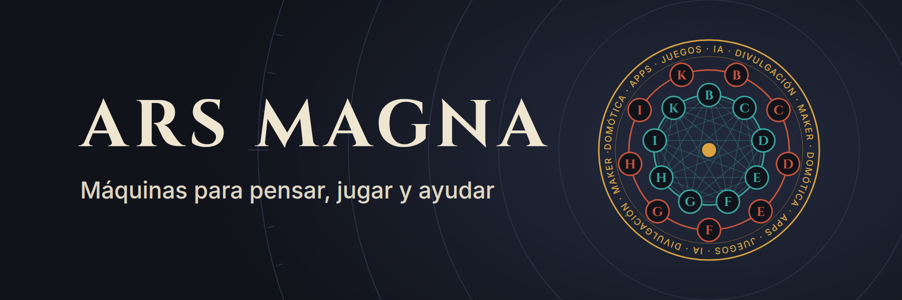

  

En 1274, en el Puig de Randa (Mallorca), Ramon Llull imaginó una máquina de ruedas de papel capaz de combinar ideas y razonar. La llamó **Ars Magna**. Siglos después inspiró a Leibniz y a los pioneros de la computación.

Aquí está el código de los proyectos del canal [Ars Magna](https://www.youtube.com/@arsmagna_lab): máquinas para pensar, jugar y ayudar, con todo lo necesario para ver cómo funcionan por dentro.

- 🔧 **Domótica y maker**: Home Assistant, electrónica y cacharros caseros
- 🎮 **Apps y juegos**: de la idea al lanzamiento
- 🤖 **Desarrollo e IA**: cómo se construye cada proyecto, errores incluidos
- 🔬 **Divulgación**: la tecnología de cada día, explicada paso a paso

Cada repositorio va con su vídeo: en el README tienes el enlace al episodio y en la descripción del vídeo, el enlace al código.

---

Por [Edu Herraiz](https://www.eduherraiz.com) · Hecho en Mallorca · 📩 youtube@eduherraiz.com
